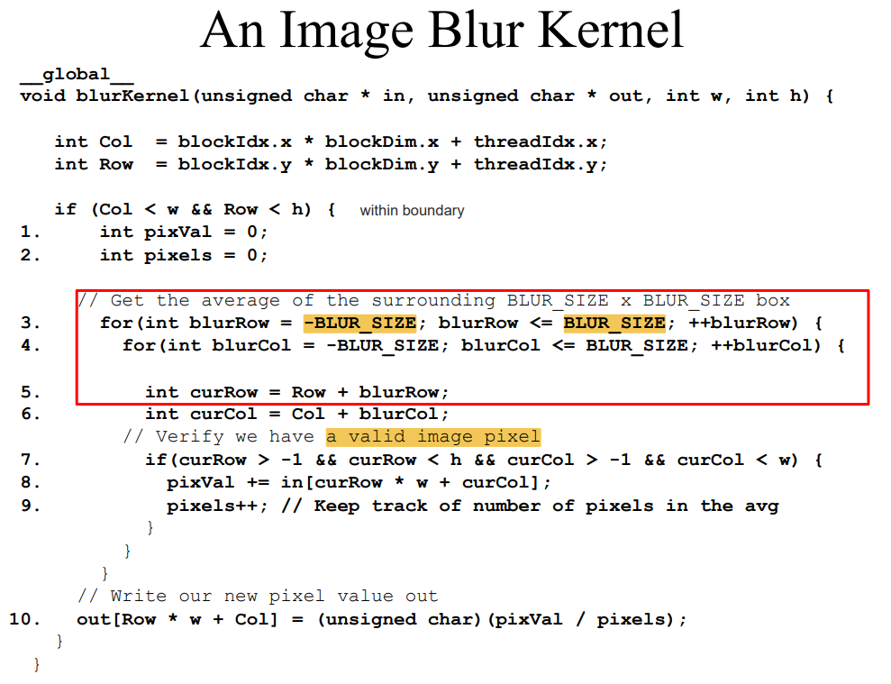
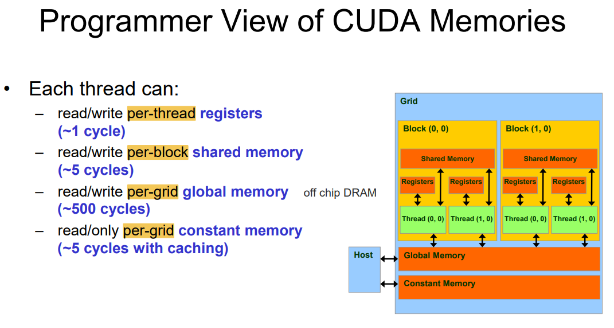
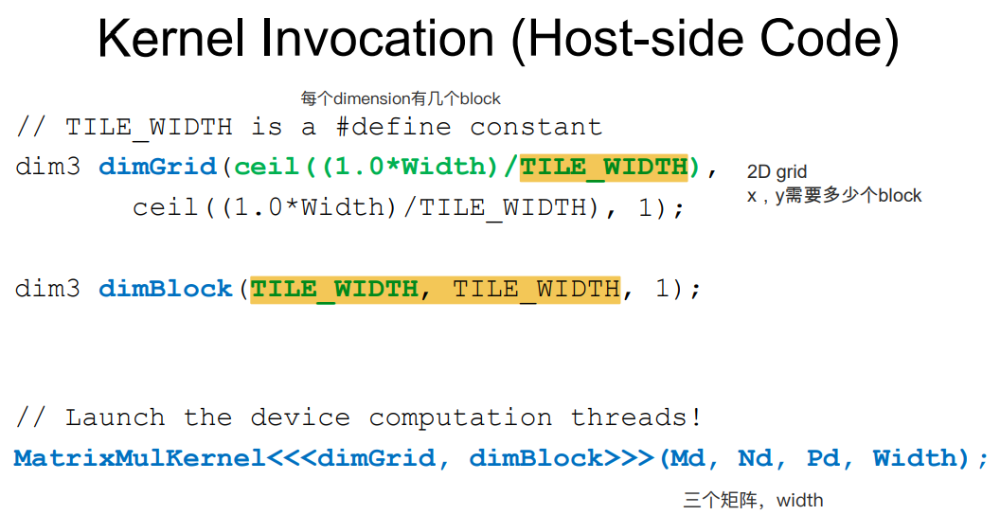
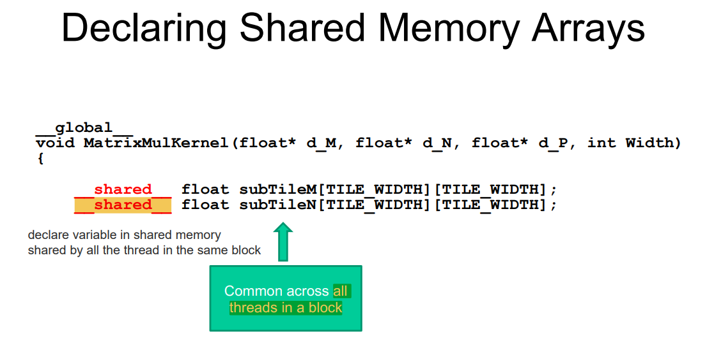
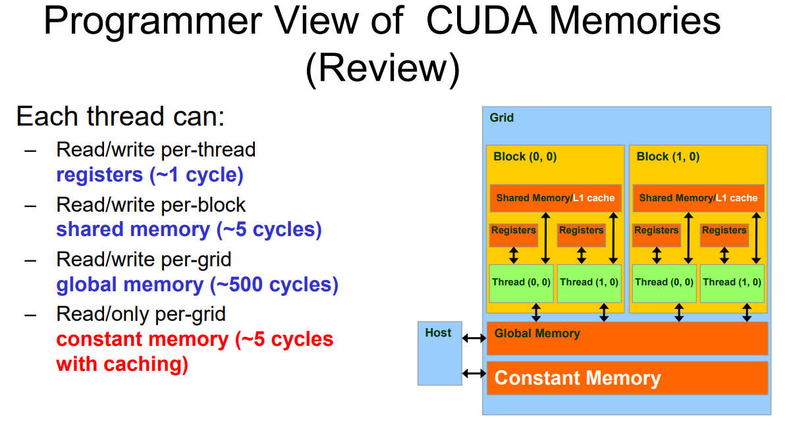

# ECE408:

## Lecture2:

每一个thread都执行相同的cuda kernel

每一个thread都有自己唯一的id。

将id map到pixel进行计算。

所有thread，称为一个grid。

一个grid中有多个block。

一个block中有array of threads。

最小的是一个thread。

### GPU中的Grid，Block，Thread和维度

一个grid每一个维度的dimension。

x，y，z的block个数。（并不一定用三个dim，可以set为1）

每一个block也有自己的dim。（三维）

对于2D的block，将Z或者Y的维度设置为1。

一个block中的thread，通过shared memory， atomic operations， barrier synchronization进行合作。

不同block中的thread很少合作。

通过block index.x（第几个block），block dimension（每个block有几个thread）和 thread index（block中第几个thread）得到 index。

将host上的ABC复制到Device

计算vector addition

将结果从GPU复制到CPU

### CPU和GPU

下面是写一个cuda kernel的过程。都需要这些部分。

建立device上的空间，从host复制到device上。

运算kernel函数。

从device上将数据传回cpu。

——global__告诉compiler，这个是cuda函数。如果不放这个，就会在cpu上运行。

这个是唯一要在gpu上运算的函数。

计算index，检查i是否小于n，进行计算。

上面蓝色的是cuda function,下面的白色部分是cpu代码。

第一维度：ceil(n/256) block的个数

第二维度：每个block有几个thread。

## Lecture3:

### 对于一维的复习

对于一维的数据，流程是：

计算出index，判断范围，符合条件的计算。

GPU的结构是高维度的，可以处理高纬度的数据，这节课先介绍在二维图像上的应用。

### 第一个应用：图像转化

这个是RGB转成灰度的代码。

每一个Block中有16*16的thread。

计算出当前thread在图像中的col和row位置。二维，需要检测两个维度的合法性，对于合法的位置计算线性的index，拿到数据，计算。

### 第二个应用 Blur：

对于一个像素，结合周围一圈像素，计算平均像素值。（类似卷积）

对于一个像素，还是先计算出像素的col和row。检测两个维度的合理性。对于合理的像素，把周围的合理的像素进行计算。

### Block和warp调度和合理性

一个block中的所有thread运行相同的代码。同一个block中的thead可以cooperate，不同block的thread很少coorperate。

Block是随机的方式执行。我们不知道。

thread 是warp order。

GPU的一些性能和能力。

每个Block map到一个SM！

**Block中的所有thread要mapping到一个SM上。一个Grid的多个Block可以在多个SM中执行。**

一个SM上有多个Block（最多32个Block）

最大的SM上可以有2048个thread。

Block被切割成一个一个Warp，每一个Warp有32个thread。比如0-31 thread属于warp0，32-63 threads属于warp1。

SM上的调度单元是Warps。每一个Warp上有32个thread。

如果有3个Block被分配到一个SM上运行，每一个Block有256个thread。（SM上总共有768个thread。）

每一个Block有8个warp，总共有24个warp轮流调度。

每一次，选一个warp，轮换。

**为什么一个SM要有这么多warp?好处是什么？**

我有很多warp可以选择。

如果一个warp stalling，正在等待memory，我们可以很快找到另一个warp执行。 

GPU是through put oriented architecture.我们不是想要更加快地执行完一个block，而是尽可能用尽硬件资源。Let hardware as busy as possible.在一个warp卡住的时候，立刻执行另一个warp。

warp之间没有priority。

## Lecture4 Memory Model

更多的warp给到SM，能让硬件越忙。重要的是throughput。

warp的调度是zero overhead。哪些warp会被调度呢？

通过pipeline的角度来看，那些operands准备好了的warp可以被调度。可以被调度的warp遵守prioritized scheduling policy。

我们不关心instruction运行多久，我们需要让硬件完全被使用。

当一个warp遇到load指令，数据很远，就会调度，将可以运行的warp运行。

图中有好几个warp在调度，例如：TB1 W1： Thread Block1, warp1

在这种图中，TB1 W1运行了6个cycle，第七个cycle卡住了，可能是硬件没法运行了。rather than waiting，我们选择调度一个新的warp。避免stall。等stall结束了，再对TB1重新进行调度。

Branch Divergence是一个问题。

指的是一个warp中的很多thread，由于有if的存在，他们会有不同的执行路径。

比如这种图，一半的thread进if，一半的thread进else。

需要等待，没有进if的thread idle，等待别的thread执行，然后进入else。之前idle的thread执行，之前执行的thread idle。

对于block size的选择。Block可以有不同的size。

我们可以调整block的size来改变GPU的利用率。但是我们不能改变Warp的大小，Warp是Architecture parameter。

一个SM会有Block和Thread的限制。

一个Block我们需要Allocate Resources。

如果一个Block是8-8的，一个block有64个thread，就算装满8个Block，也只有512个线程，没法使用完硬件的资源。

所以最佳的选择，要尽量使用完一个SM的thread的个数（一个Block中Thread多，且能被整除），且Block在范围内。

当Block是16-16的时候，一个Block256个Threads，使用6个Block可以用完SM资源。

当Block是32-32的时候，一个Block1024个Thread，只能放得下一个Block，还会有浪费。

所以说，Block的Size不能过大或者过小，需要能用尽GPU的硬件资源。

不同的Memory有不同的访问效率。

下一个重点话题： 矩阵乘法。

计算流程，P = M *N 计算每一个输出矩阵中的P（i,j）。

这两个矩阵的size都是width*width的正方形。

这个点是由M中的第i行和N中第j列计算得到的。

在两层for循环内部的那一层for循环，就是将这一行一列，进行向量运算，相加求和。

遍历M矩阵的第i行，k表示这一行的第k个元素：

M[i*width + k]

遍历N矩阵的第j列，k表示这一列的第k个元素：

N[k*width + j]

将这两个元素相乘再相加，得到结果。

如果两个矩阵不是正方形，那需要修改数量：

如果:

M： [M_row, X], N[X, N_col]

M*N : [M_row, N_col]

for i M_row		：对于结果中的第i行

​	for j N_row		对于结果中的第j列

​		for X lendth		进行vector运算。

这个是CPU的版本。（C语言的版本）

将矩阵乘法放到cuda上：

因为矩阵乘法是2D的运算，我们使用2D的Block和2D的Grid

结果P是2D的，我们也使用2D的thread来运算。将P分成多个Tiles，每一个Tile被一个Block计算。创建[ceil(Width/Tile_width)]**2个block来运算。

一个简单的例子：

我们创建一个2D的Grid。Block Width是2（Block width就是Tile width吗？）所以一个Block有4个thread，总共创建4个Block，也就是一个2*2的Grid。

另一个例子。一个8*8的矩阵，一个Block的Tile width是4，一个Block中有16个thread。

Width/Tile_width = 8/4 = 2。所以总共需要2*2 = 4个block。

这个是host的代码，声明一下grid和block的size。比较简单。

一个thread负责计算P结果矩阵中的一个结果数字。

通过BlockIdx和ThreadIdx计算出当前Thread要计算的在P矩阵中的位置。

这个计算的过程，分别计算Row和Col坐标。

Row坐标是通过y来计算。

BlockIdx.y * BlockDim.y + threadIdx.y;

Col坐标是通过x来计算。

BlockIdx.x * BlockDim.x + threadIdx.x;

**最重要的就是这个Idx到Row和Col的mapping，得到了这个mapping之后就简单了**

之后就是做一个Row Col的检查。

然后遍历Width个元素，累加，得到这个位置的值。

当我们运行这个代码，输入是几个float pointer，和width。

这些pointer是gpu global memory。

我们在运行的时候，访问Global memory。

我们主要看唯一一句，也就是累加的那一句代码。

主要的工作是：

load， load，mul，add。

对于一个load，我们有一次运算。因为两次load，对应一次add和一次mul。

这张图表现出GPU的performance被memory bound住了。

上面我们已经知道，一个load操作，会对应一次FlOP运算。一个Thread，进行一次FLOP运算，需要4B的数据。

所以4B/FLOP。

然后对应到GPU的硬件memory性能：150GB/s

150GB/s / 4B/FLOP = 37.5GFLOPS/S

所以通过memory极限计算出，最多只能计算37.5GFLOPS/S的数据。

但是GPU可能compute power有1000GFLOP/S的性能，所以被memory bound住了。

下一节课将会讲矩阵乘法的优化版本。

## Lecture3 Tiled MM

### 简易MM的问题，Global memory 限制了算力

复习了一下，上节课的，这个cuda最简易版本的MM被memory bound了。

因为所有的thread都访问Global memory，获得input element。

FLOP指的是float multiplication和float add。

在CPU中有Cache，储存可能会被reuse的数据。

在GPU中，需要programmer来手动。software managerd memory。

SM shared memory。

在之前的：

所有thread通过Global memory中获得数据

现在：

一个更小的memory：shared memory.

数据在Global memory中，然后储存在Shared memory中，再给到每一个thread。

shared memor有ample bandwidth。

### SM Memory Architecture和Shared Memory

这个是SM的Architecture。(SM : Streaming Multiprocessor)

可以看到，每一个SM都有自己的32个Block（应该是最多32个Block）。

这些Block会分成多个warp，每个warp有32个threads。每一个warp中的thread运行完全一致，不存在快慢。

每一个SM，会有自己的Register File，L1 Cache和Shared Memory。而Shared Memory很小，要节约使用。

我们先忽略L1 Cache。

Cuda programmer一般使用Shared memory来更快地访问。

可以看到，在这个SM中，Shared Memory只有164KB。

好处：

使用Shared memory，每一个thread可以parallel load data。

体现了lots of bandwidth和low latency。

坏处：

Shared memory比较小，需要自己manager。

### 使用Shared Memory

在CPU世界中，我们不需要管理Memory（implicit） ，因为有Cache的存在。

但是在GPU中，我们的算法，代码中需要考虑Memory，自己manage。(explicit)

我们可以使用shared下划线，declare variable在shared memory中，这些数据，只在Shared memory中，不在Global memory中。

这些数据，不会被所有thread share，但是被同一个Block的thread shared。(Shared by all the thread in the same block)

所以，每一个block，有一个SubTileM和一个SubTileN。

如果我们allocate的数据太大了，会有error。

### Tiled Matrix Multiply( Tiled MM) 

这里是使用Shared memory的MM方法，也是大部分cuda上的MM实现。

我们算partial dot product。一部分一部分计算。

我们有Tile_width * Tile_width个thread。每一个thread load其中的两个元素。

一个thread对应P上的一个output，对于M上的一个数据和N上的一个数据。

所以load一个M的数据，load一个N上的数据。

通过这四张图，可以看到Tiled MM的计算过程。

首先，将P分成了4个Block，每个Block中有4个threads。每一个thread负责计算一个P上的数值结果。

这4个Block同时计算，每一个都有自己distinct的shared memory。

对于左上角的这个Block，他里面的4个thread，一次分别load M和N中的4个元素。

load之后，用M的sub行（一行中的前两个），dot product N的sub 列。进行一次partial dot product计算。

再之后loadM的一行中的后两个，和N一列中的后两个，计算第二次partial dot product。

通过两次计算，计算得到P左上角四个值的最终结果。

可以看到，P中的每一个数字，得到结果，需要4次运算。

M和N中的每一个数字，总共需要进行4次的运算。

比如M0,0，需要和N0,0, N1,0 , N2,0, N3,0分别一次运算。（最大的Reuse是4？也就是不分block？）

而现在，左上角的Block是2*2的，将数字load进入内存之后，M0,0分别和N0,0 ， N1,0进行了运算，所以服用了两次。

是不是可以认为，一个Block是Tile_Size * Tile_Size的，那一个数字复用的次数就是Tile_Size? 感觉是这样的。

这个是Tiled MM的incorrect代码。

重点应该是8-13行。

每一个thread在一次循环中，需要将两个元素load进入shared memory。

这个代码假设Width可以整除TILE_WIDTH。

## Lecture6

### Thread Synchronization

为什么上面个代码是错误的？

因为thread之间有快慢。（是指不同warp的thread由于调度，会有速度差异？但是同一个warp的thread的速度是相同的）

如果快的thread执行到dot product，如果慢的thread还没有load当前tile的数据。

如果是第一个loop，快的thread会load uninitialized data。

如果是后面的loop，快的thread会load上一个tile的数据。（但thread并不知道）

所以这是incorrect的地方。

**Synchronization是对一个Block中的所有Thread进行synchronization，如果Block中的threads太多，synchronization会比较慢。**

问题：

这个shared memory是被一个block中的所有thread可见的。

所以如果有9个Block，那就会有9个distinct的shared:subTileM和subTileN。

synchronous step是怎么实现的呢：

大致的方法是：

使用atomic counter，当一个thread进入Barrier，我们增加atomic counter，然后我们check，这个counter是否达到thread number。只有当atomic counter的值达到thread number，我们能够leave。

过多的syncthreads()会导致程序的运行变慢。

### MM和Tiled MM做个对比。

仍然用原先的GPU来举例。

如果我们使用16*16的Tiles，我们将每个operand（M或者N的数据），复用了16次。（Partial Reuse）

那我们减少了Global memory的access，16倍。可以达到600GFLOPS！

如果我们使用32*32的Tiles，那每个数据就复用了32倍。

TILE_WIDTH是不是就是Block Width？应该就是的吧。可以达到1200GFLOPS！

可以看到，通过Tiled MM的方法，Memory Bandwidth已经不是bottleneck！

SM的限制也是重要的因素。

* Shared memory大小有限，我们使用了Block越大，reuse越大，但是使用的Shared Memory越多。
* Block越大，一个Block中的threads个数越多。synchronization的时候等待越久。

如果我们使用Maxwell的结构：

一个SM只有64KB的Shared Memory。

如果Tile Width是16，一个Block有256个threads。每一个Threads需要8B（MN各一个）的数据。

所以一个Block需要：256*8B = 2KB的Shared Memory用量。

一个SM最多能有2048个Threads，最多只能有8个Blocks。

如果是32*32 的Tiled Width，我只能放两个Blocks。（Threads不够了）

通过这些GPU Query可以得知，一个有多少device，和device Property。

比如一个Block最多几个thread。

### 如果Matrix Width不能整除Tile Width怎么办？

如果我们的MNP都是3*3的。但是我们需要放Block在上面，我们使用2-2的block。

上面这张图是我们已经计算好M00,M01,M10,M11和N左上角部分的partial dot product之后的下一步。

我们需要loadM的右边行，和N的下边列。然后进行运算。

会发现，很多thread的位置上没有数字。对此我们提出了简单的解决思路。

如果target位置，在内部，load it，如果不在内部，write0。同时存储P的时候判断在内部的再存储。

这是最简单的implementation。

同时，我们需要改变Tile Count。

于是得到了下面的修改过的代码:

重新计算Tile Width，在Load的时候判断，在存P的时候判断。

### Global memory bandwidth:

我们需要很大的DRAM，但是DRAM很慢。

由于我们需要很多的bit，我们需要很多电容，电容需要很小，导致读的速度很慢。dense，所以slow。

这个是DRAM的简易图片，也就是访问，通过Row address和column address，访问数据。

temporal locality

我们用过的很有可能会再用。

spatial locality。

我们用x，x边上的数据很可能会被用。（array储存方式）

Burst是对于DRAM的optimization，based on spatial locality。

所以DRAM always使用burst mode。我的理解是会有额外的burst bytes被传输，这些bytes会被遗弃，如果没有访问sequential locations。

如果我需要load X， load X+1， load Y

当load X的时候，会很久，才能得到X的数据，但是，load X+1， 马上能得到X+1位置的数据。这就是burst data。

从图里能够看到，如果不使用burst，需要每一次都很久才能拿到数据。

但是如果使用burst，第一次需要很久，后面就可以很快拿到数据。

这个是2D matrix在memory中的存储。在memory中是线性存储的。

当我们访问一个位置，后面的data会burst through。如果我们的burst length足够长，我访问一个位置，我可以得到很多线性的数据。

现在我们看最初的MM代码。

对于M矩阵，我们按照行的方式获得data。对于N矩阵，我们通过列的方式获得data。

直觉上我们认为，M是friendly的，N是unfriendly的。

但是不对！

举个例子：

我们有1个warp，里面有32个thread，这32个thread是完全同步的。

对于M矩阵，这32个thread，同时读不同的row，他们处在同一列。他们之间的address差别是Width，而且不是sequential的。

对于N矩阵，这32个thread，同时读不同的列，他们处在同一行。他们之间的address差别是1，是sequential的。

所以我们说access N是coalesced,他是sequential的，是burst friendly的。

我们说，accessM不是coalesced的，因为他不是sequential，没法利用burst。

因为M矩阵的这个问题，我们想要使Tiled matrix multiplication能够coalescing。

## Lecture7

### 1D和2D的的卷积运算

这是1D的convolution例子。

这是1D Convolution的edge case。

这个代码比较好懂，这里解释一下：

首先计算出，当前thread计算的一维位置Index。通过Block index和thread index来计算。

然后找到起始位置，loop循环Mask_Width次数，进行M和N的dot product。这里要check index不能超出1维长度，不能比0小。

最终保存P的值。

这就是一个2D的卷积运算。

这个是当filter在边缘情况之外的情况。

在卷积操作之后，需要乘上1/273，来做一个normalization。

可以看出，不同的卷积核有不同的作用。但是在卷积神经网络中，卷积核并不是指定的，而是训练得到的。

卷积神经网络中的卷积核就是被训练出来的（并不是指定的卷积核） 。来起到不同的作用。

我们可以通过卷积核，来发现图片中的特征。

我们会发现，小的卷积核比大卷积核有用，因为小卷积可以找到local features，很有用。

M是mask，也就是卷积核。计算P中的一个点，需要M。

M在我们的计算中**没有改变**，同时我们每一次计算P的元素，访问M，都是**相同的顺序**。

如果P中有1Million个元素，我们需要访问M按照相同的顺序1Million次。

因为M没有改变，**M是一个很好的candidate for Constant Memory**。

为什么GPU有Constant Memory？

在3D Graphics中，有个Texture，在Chip上有很多Texture Memory。

教授上课没有仔细说Texure memory和Constant Memory的细节，我问了问GPT：

Texture Memory主要用于储存图像，纹理等数据。具有特殊的缓存机制。访问时提供高效的空间局部性，读取速度较快，写入速度较慢。

Constant Memory主要用于储存程序执行中不会改变的数据。有较小的储存空间，可以在多个线程之间共享。读取速度较快，到那时不支持写入操作。

### Constant Memory和Cache

Global Memory是Off the Chip。Constant Memory是Off Chip的。

我们可以访问Constant Memory很快。Constant Memory有Cache。当我们访问Constant Memory的数据，这些数据会pulled closed to where computing is happen自动的（不像Shared Memory，我们需要自己manage）

Memory burst。包含1024个连续的bit。我们把一个burst称为line。

Cache是array of cache lines（和tags）。Memory read由于memory burst会制造出line，tag标记了line的Memory地址。

### Shared Memory和Cache

Shared Memory是CUDA中另一种减轻Global Memory狂用的方式。

Shared Memory举例SM的举例和L1 Cache的距离相似。

和Cache不同的是，Shared Memory中的数据并不一定是Main memory中拷贝来的副本。Shared Memory需要显性的数据transfer，也就是programmer自己load数据，但是Cache不需要。

Shared Memory和Cache都在SM内部，SM中的所有thread访问这两个都很快。但区别是programmer control shared memory，需要自己将data复制到Shared Memory。对于Cache，contenst是implicit，当我访问data，下一次访问，他可能被Cache了，可能没被Cache，我们不知道。

GPU中有Constant Memory和L1 Cache。

### GPU上的Cache只存Constant的数据？？？

这里教授举了一个例子：

有两个threads，在两个SM上。一个Thread访问了X位置，另一个Thread也访问了X位置。如果一个SM上的Thread write to X。并且两个SM上都Cache了X位置的数据。我们需要保证，当一个SM更新X数据，另一个SM能看到X的updates。所以我们需要保持所有SM的Cache Consistent，但是这很expensive。所以我们说，对于GPU Caches，我们Only Cache constant。因为这些值不会变化，所以我们不用管consistent的问题，没有thread会update const的数据。（只要thread update了数据，我们就会遇到consistency的问题）

但是我问了问GPT，GPU上SM内部的L1 Cache只储存Constant数据吗？它说不是。所以，到底是不是？

### 如何使用Constant Memory?

在Convolution的例子中，我们将M（Mask）放在Constant Memory中。

需要Allocate M在所有的function的外面。使用constant修饰。

将数据copy的时候使用cudaMemcpyToSymbol这个API。

#### Constant Memory是如何克服Bottleneck的呢？

当很多个thread访问Constant Memory的时候，第一次访问，会很慢(这依旧是一个BottleNeck)，因为需要从Constant Memory里第一次获取Kernel的数据。但是，这之后，这些访问了的数据就会被Cache，后续的访问计算就会很快，hit Cache。

**Constant Memory是Off Chip，访问速度很慢，但是访问过之后，数据会被自动Cache，访问速度很快。**

